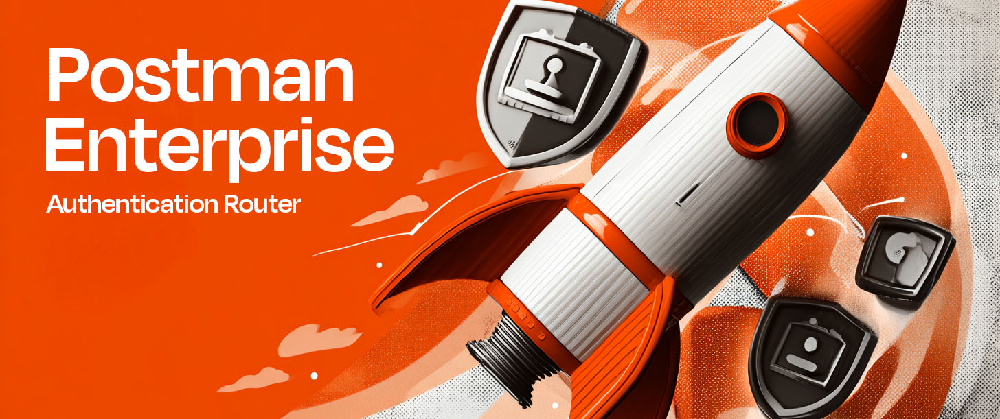

# Postman AuthRouter (Go)

Enterprise authentication (SAML) enforcement for Postman Desktop Enterprise.

**Fully Tested & Validated as of August 2025:**
- **macOS**: Installation and configuration validated via JAMF on macOS 15.6 Sequoia
- **Windows**: Installation and configuration validated via Microsoft Intune MDM on Windows 10 22H2 and Windows 11 24H2
- **Build Environment**: Tested on macOS 15.5 Ventura for both Windows and macOS deployments, Windows 10/11 for Windows deployment.

## Quick Start

**See Platform-Specific Guides:**
- **[macOS Enterprise Deployment](deployment/macos/README.md)** - PKG packages with MDM certificate profiles
- **[Windows Enterprise Deployment](deployment/windows/README.md)** - MSI packages with automated certificate trust

**How It Works:**
The build scripts work with **any version** of Postman Enterprise:
- Place your organization's Postman Enterprise .pkg (macOS) or .msi (Windows) in the deployment folder
- The build scripts automatically enhance them with organization-bound SAML enforcement capabilities
- Configurable via deployment-time configuration via MDM/GPO
- Automatic certificate trust management, complete uninstall support, enterprise logging and monitoring
- No user interaction required

**Test with Your Identity Provider:**
1. Deploy test package to pilot machines via MDM/GPO
2. Verify SAML redirection to your SSO provider
3. Confirm certificate trust deployment via MDM profiles
4. Validate compliance logging and monitoring

## Project Structure

```
postman_saml_enforcer_go/
├── cmd/
│   └── pm-authrouter/          # Main application entry points
├── internal/
│   ├── config/                 # Configuration management
│   ├── dns/                    # DNS interception
│   ├── proxy/                  # HTTPS proxy server and handlers
│   ├── sessions/               # Browser session cleanup
│   ├── system/                 # System integration
│   └── tls/                    # Certificate management
├── ssl/                         # [SSL certificates](ssl/README.md)
├── deployment/
│   ├── macos/                  # [macOS Deployment Guide](deployment/macos/README.md)
│   └── windows/                # [Windows Deployment Guide](deployment/windows/README.md)
├── dev/
│   └── service/
│       ├── macos/              # [macOS Development Guide](dev/service/macos/README.md)
│       └── windows/            # [Windows Development Guide](dev/service/windows/README.md)
├── test/
│   ├── macos/                  # macOS test scripts
│   └── windows/                # Windows test scripts
```

## The Problem

"How do we force our users to log in with our company SSO instead of personal accounts?"

Teams want to ensure that:
- Employees use corporate-managed accounts, not personal Gmail/Yahoo accounts
- All API usage is properly audited and tied to company identity
- Sensitive collections and environments stay within corporate boundaries
- Data exfiltration risks are effectively nullified (short of intentional malice)

Traditional approaches like blocking Postman entirely create terrible user experiences and drive employees to workarounds that are even less secure.

## The Solution

1. Configure SSO in Postman Enterprise
2. Enforce Device Trust for your SAML flow to ensure *only* company devices can access your Enterprise team.
3. Deploy this via MDM to all company devices, ensuring that company devices can *only* access *your* Postman Enterprise team:
```
#Deploy with:
--team "yourteam" --samlurl "https://identity.getpostman.com/sso/*******/init"
```
### *Done!*

This helper provides seamless SAML enforcement by intelligently intercepting Postman's authentication flow. Instead of blocking access, it transparently redirects users to your enterprise SSO provider, eliminating the team selection screen and authentication method choices entirely.

### Why a Helper is Necessary

Simple DNS redirection or basic HTTP redirects won't work for SAML enforcement because:

- **Parameter Transformation**: Authentication requests contain critical parameters (`auth_challenge`, `continue`, `team`) that must be preserved and transformed for proper SAML flow
- **Selective Interception**: Only specific authentication paths need redirection - everything else must proxy normally to maintain Postman functionality
- **SSL Termination**: Browsers expect valid SSL certificates for `identity.getpostman.com` - the helper generates and trusts certificates automatically
- **CDN Compatibility**: Real Postman servers use CDN infrastructure requiring proper SNI headers that simple redirects can't provide
- **Environment Resilience**: Enterprise environments often have DNS proxies, virtualization, and network security tools that block simple DNS methods, requiring advanced fallback techniques

**Why This is the Best Possible Solution:**

- Works on or off corporate network
- Eliminates accidental data exfiltration scenarios entirely
- Works with both Postman Desktop and web applications
- Encourages proper collaboration within the corporate workspace

*For Users:*
- Totally seamless UX - users are redirected to corporate login smoothly

*For IT:*
- Deploys alongside the Postman Enterprise App
- Centralized deployment through standard enterprise tools (SCCM, Jamf Pro, etc.)
- Works with existing SAML infrastructure (Okta, Azure AD, etc.)
- Comprehensive logging and monitoring capabilities
- Easy rollback if issues arise

## Technical Implementation

The helper operates as an intelligent SSL proxy with multi-layered DNS interception:

1. **Multi-Method DNS Interception**: Uses fallback strategies including hosts file, Windows Filtering Platform, macOS Network Extensions, and registry overrides
2. **Selective Interception**: Only intercepts authentication endpoints (`/login`, `/enterprise/login`, `/enterprise/login/authchooser`)
3. **Parameter Preservation**: Extracts and forwards authentication parameters to your SAML provider
4. **Transparent Proxying**: All other requests pass through to real Postman servers with proper SSL/SNI handling and CDN compatibility
5. **CDN-Aware**: Preserves SNI headers for correct CDN routing (Cloudflare, Fastly)
6. **Zero-Copy Streaming**: Utilizes exact byte preservation

This ensures normal Postman functionality while enforcing corporate authentication policies without breaking existing workflows.

### Multi-Layer DNS Resilience
The DNS interception cascades through 3 or more separate methods on each platform. When environments break one method, the system automatically switches to another:
- **Windows**: WFP (Windows Filtering Platform) → API Hooking → Registry DNS Override → Hosts File
- **macOS**: Network Extensions → pfctl (packet filter) → route manipulation → Hosts File
- **Linux**: iptables → nftables → Hosts File

Each fallback method is progressively less intrusive, ensuring compatibility even in highly restricted environments.

### Self-Healing System Integration
Every system modification includes automatic recovery:
- 30-second health check loops detect and repair removed hosts entries
- Certificate validation with automatic regeneration on expiry
- Service recovery with exponential backoff (5s, 10s, 15s)
- Atomic operations with rollback capability - nothing gets left broken

## Other Documentation

## Session Management (EXPERIMENTAL)

The AuthRouter includes comprehensive session clearing functionality to ensure fresh authentication flows:

### Clear All Postman Sessions

Use the `refresh` command to clear all existing Postman authentication sessions:

```bash
# macOS
sudo dev/service/macos/install-service.sh refresh

# Windows (as Administrator)
.\service\windows\install-service.ps1 refresh
```

**What this clears:**
- **Browser Cookies:** All Postman authentication cookies from Chrome, Firefox, Safari, and Edge using direct binary manipulation
- **Application Sessions:** Postman Desktop and Postman Enterprise session files
- **Process Management:** For applications that require restart (Firefox, Desktop Apps), does so gracefully

**When to use:**
- Initial deployment to ensure all users get fresh SAML authentication
- After changing SAML configuration or identity provider settings
- When users report authentication issues or cached login states
- As part of routine maintenance to enforce policy compliance

This ensures users cannot bypass SAML enforcement through cached authentication tokens or sessions.

## Security & Compliance

**Security Features:**
- **Zero Trust Enforcement**: All authentication through corporate SSO
- **Certificate Pinning**: Self-signed certificates trusted via MDM/GPO only
- **Selective Interception**: Only auth paths redirected, all other traffic passes through
- **Local Binding**: 127.0.0.1:443 prevents external access
- **Audit Trail**: Comprehensive logging for compliance reporting

**Enterprise Security:**
- Prevents accidental data exfiltration to personal accounts
- Enforces corporate identity for all Postman API usage
- Works on/off corporate network
- Transparent to end users

### Other Documentation

For local development and testing:
- **[Testing Guide](test/README.md)** - Functional Testing framework and validation
- **[macOS Development Guide](dev/service/macos/README.md)** - Local LaunchDaemon installation
- **[Windows Development Guide](dev/service/windows/README.md)** - Local Windows Service installation

**Build from Source:**
```bash
./dev/build.sh  # Builds for all platforms
```

## Note for Postman

This solution is CI/CD-ready. Postman can drag and drop and enable secure collaboration for tens of thousands more highly-secure Postman Enterprise users overnight - zero product modification necessary - just stick it in the build pipeline, and whenever a new version is pushed the build scripts automatically enhance any Postman Enterprise installer with mandatory SSO enforcement, configurable at install-time. Easy peasy.
